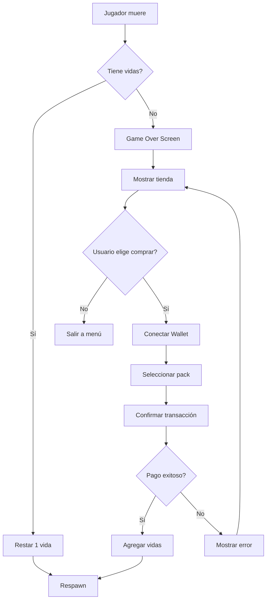

# 💰 Diseño del Sistema de Pagos con Solana
**Proyecto:** Depression Game - Life System
**Wallet de Recepción:** `az62CTg4Gm7YtSxrDVvm9z9ow1j7d8mVwW4cXvdQtN3`

---

## 🎯 Objetivo

Implementar un sistema de vidas que permita a los jugadores:
1. Jugar con vidas limitadas (3 iniciales)
2. Perder una vida al morir
3. Comprar vidas adicionales con criptomonedas (Solana/SOL)
4. Conectar su wallet Solana para realizar pagos

---

## 🏗️ Arquitectura del Sistema

### 1. **Sistema de Vidas**

```javascript
// Estructura de datos
gameState.lives = {
    current: 3,        // Vidas actuales
    max: 99,          // Máximo de vidas que se pueden tener
    lastDeath: null,  // Timestamp de última muerte
    totalDeaths: 0    // Contador de muertes totales
};
```

**Mecánicas:**
- Jugador empieza con 3 vidas
- Al morir: `-1 vida`
- Si vidas = 0: Game Over Screen con opción de comprar más
- Mostrar contador de vidas en HUD

---

### 2. **Integración con Solana**

**Biblioteca:** Phantom Wallet + Solana Web3.js

```javascript
// Dependencias necesarias
<script src="https://unpkg.com/@solana/web3.js@latest/lib/index.iife.min.js"></script>
```

**Wallet de Recepción (TU WALLET):**
```
az62CTg4Gm7YtSxrDVvm9z9ow1j7d8mVwW4cXvdQtN3
```

---

### 3. **Productos y Precios**

| Producto | Vidas | Precio (SOL) | Precio USD (aprox) | Descuento |
|----------|-------|--------------|-------------------|-----------|
| 1 Vida   | 1     | 0.001        | ~$0.10            | 0%        |
| Pack Pequeño | 5 | 0.004     | ~$0.40            | 20%       |
| Pack Grande | 10 | 0.007      | ~$0.70            | 30%       |
| Pack Mega | 25   | 0.015        | ~$1.50            | 40%       |

*Nota: Precios basados en SOL ≈ $100 USD (ajustables)*

---

### 4. **Flujo de Usuario**



---

### 5. **Componentes UI Necesarios**

#### A. **HUD - Contador de Vidas**
```html
<div class="lives-counter">
    ❤️ Vidas: <span id="livesCount">3</span>
</div>
```

#### B. **Tienda Modal**
```html
<div id="shop-modal" class="modal hidden">
    <div class="modal-content">
        <h2>💰 Tienda de Vidas</h2>
        <p>Te quedaste sin vidas. ¡Compra más para continuar!</p>

        <div class="wallet-section">
            <button id="connect-wallet">🔗 Conectar Phantom Wallet</button>
            <p id="wallet-address" class="hidden"></p>
        </div>

        <div class="products">
            <div class="product-card" data-lives="1" data-price="0.001">
                <h3>1 Vida</h3>
                <p class="price">0.001 SOL</p>
                <button class="buy-btn">Comprar</button>
            </div>
            <div class="product-card featured" data-lives="5" data-price="0.004">
                <span class="badge">20% OFF</span>
                <h3>Pack de 5 Vidas</h3>
                <p class="price">0.004 SOL</p>
                <p class="original-price">0.005 SOL</p>
                <button class="buy-btn">Comprar</button>
            </div>
            <div class="product-card" data-lives="10" data-price="0.007">
                <span class="badge">30% OFF</span>
                <h3>Pack de 10 Vidas</h3>
                <p class="price">0.007 SOL</p>
                <p class="original-price">0.010 SOL</p>
                <button class="buy-btn">Comprar</button>
            </div>
            <div class="product-card premium" data-lives="25" data-price="0.015">
                <span class="badge">⭐ 40% OFF</span>
                <h3>Pack MEGA</h3>
                <p class="price">0.015 SOL</p>
                <p class="original-price">0.025 SOL</p>
                <button class="buy-btn">Comprar</button>
            </div>
        </div>

        <button class="modal-close">Cerrar</button>
    </div>
</div>
```

#### C. **Confirmación de Compra**
```html
<div id="purchase-confirm" class="modal hidden">
    <div class="modal-content">
        <h2>Confirmar Compra</h2>
        <p>Estás comprando: <strong id="confirm-product"></strong></p>
        <p>Precio: <strong id="confirm-price"></strong> SOL</p>
        <p>Recibirás: <strong id="confirm-lives"></strong> vidas</p>

        <div class="modal-buttons">
            <button id="confirm-purchase" class="game-button">Confirmar</button>
            <button id="cancel-purchase" class="game-button">Cancelar</button>
        </div>
    </div>
</div>
```

---

### 6. **Código JavaScript - Solana Integration**

```javascript
// ============================================
// SOLANA PAYMENT SYSTEM
// ============================================

const SolanaPayment = {
    // Tu wallet de recepción
    RECIPIENT_WALLET: 'az62CTg4Gm7YtSxrDVvm9z9ow1j7d8mVwW4cXvdQtN3',

    // Configuración de red (devnet para pruebas, mainnet-beta para producción)
    NETWORK: 'mainnet-beta', // Cambiar a 'mainnet-beta' para producción

    // Estado
    connection: null,
    walletAddress: null,

    // Inicializar conexión
    init() {
        // Conectar a Solana (usa RPC público o tu propio nodo)
        const endpoint = this.NETWORK === 'mainnet-beta'
            ? 'https://api.mainnet-beta.solana.com'
            : 'https://api.devnet.solana.com';

        this.connection = new solanaWeb3.Connection(endpoint, 'confirmed');
        console.log('Solana connection initialized');
    },

    // Conectar Phantom Wallet
    async connectWallet() {
        try {
            // Verificar si Phantom está instalado
            if (!window.solana || !window.solana.isPhantom) {
                alert('Por favor instala Phantom Wallet: https://phantom.app/');
                window.open('https://phantom.app/', '_blank');
                return false;
            }

            // Conectar
            const response = await window.solana.connect();
            this.walletAddress = response.publicKey.toString();

            console.log('Wallet connected:', this.walletAddress);
            return true;
        } catch (error) {
            console.error('Error connecting wallet:', error);
            alert('Error al conectar wallet: ' + error.message);
            return false;
        }
    },

    // Desconectar wallet
    async disconnectWallet() {
        try {
            if (window.solana) {
                await window.solana.disconnect();
                this.walletAddress = null;
                console.log('Wallet disconnected');
            }
        } catch (error) {
            console.error('Error disconnecting:', error);
        }
    },

    // Procesar pago
    async purchaseLives(lives, priceSOL) {
        try {
            if (!this.walletAddress) {
                throw new Error('Wallet no conectada');
            }

            // Convertir SOL a lamports (1 SOL = 1,000,000,000 lamports)
            const lamports = priceSOL * solanaWeb3.LAMPORTS_PER_SOL;

            // Crear transacción
            const transaction = new solanaWeb3.Transaction().add(
                solanaWeb3.SystemProgram.transfer({
                    fromPubkey: new solanaWeb3.PublicKey(this.walletAddress),
                    toPubkey: new solanaWeb3.PublicKey(this.RECIPIENT_WALLET),
                    lamports: lamports
                })
            );

            // Obtener blockhash reciente
            transaction.recentBlockhash = (
                await this.connection.getLatestBlockhash()
            ).blockhash;
            transaction.feePayer = new solanaWeb3.PublicKey(this.walletAddress);

            // Firmar y enviar transacción
            const signed = await window.solana.signAndSendTransaction(transaction);

            // Esperar confirmación
            const confirmation = await this.connection.confirmTransaction(
                signed.signature,
                'confirmed'
            );

            if (confirmation.value.err) {
                throw new Error('Transacción falló');
            }

            console.log('Transacción exitosa:', signed.signature);

            // Retornar éxito
            return {
                success: true,
                signature: signed.signature,
                lives: lives
            };

        } catch (error) {
            console.error('Error en pago:', error);
            return {
                success: false,
                error: error.message
            };
        }
    },

    // Verificar balance (opcional - para mostrar al usuario)
    async getBalance() {
        try {
            if (!this.walletAddress) return 0;

            const balance = await this.connection.getBalance(
                new solanaWeb3.PublicKey(this.walletAddress)
            );

            return balance / solanaWeb3.LAMPORTS_PER_SOL;
        } catch (error) {
            console.error('Error getting balance:', error);
            return 0;
        }
    }
};
```

---

### 7. **Integración en el Game Loop**

```javascript
// Modificar sistema de muerte
function handlePlayerDeath() {
    // Restar vida
    gameState.lives.current--;
    gameState.lives.totalDeaths++;
    gameState.lives.lastDeath = Date.now();

    // Actualizar HUD
    updateLivesDisplay();

    // Verificar si tiene vidas
    if (gameState.lives.current <= 0) {
        // Game Over - mostrar tienda
        showGameOverShop();
    } else {
        // Respawn normal
        respawnPlayer();
        showNotification(`Vidas restantes: ${gameState.lives.current}`, 'warning');
    }
}

// Actualizar display de vidas
function updateLivesDisplay() {
    const livesElement = document.getElementById('livesCount');
    if (livesElement) {
        livesElement.textContent = gameState.lives.current;

        // Efecto visual si quedan pocas vidas
        if (gameState.lives.current <= 1) {
            livesElement.classList.add('critical');
        } else {
            livesElement.classList.remove('critical');
        }
    }
}

// Mostrar tienda cuando Game Over
function showGameOverShop() {
    Game.state = GameStates.SHOP;
    document.getElementById('shop-modal').classList.remove('hidden');
}

// Procesar compra de vidas
async function buyLives(lives, price) {
    // Mostrar loading
    showNotification('Procesando pago...', 'info');

    // Procesar pago
    const result = await SolanaPayment.purchaseLives(lives, price);

    if (result.success) {
        // Agregar vidas
        gameState.lives.current += lives;
        if (gameState.lives.current > gameState.lives.max) {
            gameState.lives.current = gameState.lives.max;
        }

        // Guardar en localStorage
        saveGame();

        // Actualizar display
        updateLivesDisplay();

        // Cerrar tienda
        document.getElementById('shop-modal').classList.add('hidden');

        // Respawn
        respawnPlayer();
        Game.state = GameStates.PLAYING;

        // Notificación de éxito
        showNotification(
            `¡Compra exitosa! +${lives} vidas. Transacción: ${result.signature.substring(0, 8)}...`,
            'success'
        );
    } else {
        // Error
        showNotification(
            `Error en la compra: ${result.error}`,
            'error'
        );
    }
}
```

---

### 8. **Estilos CSS para la Tienda**

```css
/* Lives Counter */
.lives-counter {
    position: absolute;
    top: 60px;
    left: 20px;
    color: white;
    font-size: 20px;
    text-shadow: 2px 2px 4px rgba(0,0,0,0.8);
    background: rgba(0,0,0,0.5);
    padding: 10px 20px;
    border-radius: 10px;
    backdrop-filter: blur(10px);
}

.lives-counter.critical {
    animation: pulse-red 1s ease-in-out infinite;
    color: #ef4444;
}

@keyframes pulse-red {
    0%, 100% { transform: scale(1); }
    50% { transform: scale(1.1); }
}

/* Shop Modal */
#shop-modal .products {
    display: grid;
    grid-template-columns: repeat(auto-fit, minmax(200px, 1fr));
    gap: 20px;
    margin: 30px 0;
}

.product-card {
    background: linear-gradient(135deg, rgba(102, 126, 234, 0.2), rgba(118, 75, 162, 0.2));
    border: 2px solid rgba(102, 126, 234, 0.5);
    border-radius: 15px;
    padding: 20px;
    text-align: center;
    position: relative;
    transition: all 0.3s ease;
}

.product-card:hover {
    transform: translateY(-5px);
    box-shadow: 0 10px 30px rgba(102, 126, 234, 0.4);
}

.product-card.featured {
    border-color: #fbbf24;
    background: linear-gradient(135deg, rgba(251, 191, 36, 0.2), rgba(245, 158, 11, 0.2));
}

.product-card.premium {
    border-color: #a855f7;
    background: linear-gradient(135deg, rgba(168, 85, 247, 0.2), rgba(147, 51, 234, 0.2));
}

.product-card .badge {
    position: absolute;
    top: -10px;
    right: -10px;
    background: #ef4444;
    color: white;
    padding: 5px 10px;
    border-radius: 20px;
    font-size: 12px;
    font-weight: bold;
}

.product-card h3 {
    font-size: 24px;
    margin-bottom: 10px;
    color: white;
}

.product-card .price {
    font-size: 28px;
    color: #fbbf24;
    font-weight: bold;
    margin: 10px 0;
}

.product-card .original-price {
    text-decoration: line-through;
    opacity: 0.5;
    font-size: 16px;
}

.buy-btn {
    background: linear-gradient(135deg, #10b981, #059669);
    color: white;
    border: none;
    padding: 12px 30px;
    border-radius: 8px;
    font-size: 16px;
    font-weight: bold;
    cursor: pointer;
    transition: all 0.3s ease;
    margin-top: 15px;
}

.buy-btn:hover {
    transform: scale(1.05);
    box-shadow: 0 5px 15px rgba(16, 185, 129, 0.4);
}

/* Wallet Section */
.wallet-section {
    margin: 20px 0;
    padding: 20px;
    background: rgba(0,0,0,0.3);
    border-radius: 10px;
}

#connect-wallet {
    background: linear-gradient(135deg, #9333ea, #7c3aed);
    color: white;
    border: none;
    padding: 15px 30px;
    border-radius: 10px;
    font-size: 18px;
    font-weight: bold;
    cursor: pointer;
    transition: all 0.3s ease;
}

#connect-wallet:hover {
    transform: translateY(-2px);
    box-shadow: 0 6px 20px rgba(147, 51, 234, 0.4);
}

#wallet-address {
    margin-top: 10px;
    color: #10b981;
    font-family: monospace;
    font-size: 14px;
}
```

---

### 9. **Seguridad y Mejores Prácticas**

✅ **Implementado:**
- Verificación de Phantom Wallet
- Confirmación de transacciones
- Manejo de errores robusto
- Validación de balance

⚠️ **Recomendaciones:**
1. **Backend Verification (Opcional pero recomendado):**
   - Verificar transacciones en un servidor backend
   - Prevenir clientes modificados

2. **Rate Limiting:**
   - Limitar compras por minuto
   - Prevenir spam

3. **Logging:**
   - Guardar todas las transacciones
   - Tracking de compras exitosas

4. **Testing:**
   - Probar primero en Devnet
   - Luego migrar a Mainnet

---

### 10. **Migración de Devnet a Mainnet**

**Para Pruebas (Devnet):**
```javascript
NETWORK: 'devnet'
```
- Usar SOL de prueba (gratis)
- No cuesta dinero real
- Probar toda la funcionalidad

**Para Producción (Mainnet):**
```javascript
NETWORK: 'mainnet-beta'
```
- SOL real
- Transacciones reales
- Dinero real

---

### 11. **Plan de Implementación**

1. ✅ Diseño completo
2. 🔧 Agregar script de Solana Web3.js al HTML
3. 🔧 Implementar sistema de vidas en gameState
4. 🔧 Crear UI de tienda (HTML + CSS)
5. 🔧 Implementar SolanaPayment object
6. 🔧 Conectar eventos de botones
7. 🔧 Integrar con game loop
8. 🧪 Testing en Devnet
9. 🚀 Deploy a Mainnet
10. 📊 Monitoreo de transacciones

---

### 12. **Costos Estimados**

**Transacciones Solana:**
- Fee por transacción: ~0.000005 SOL (~$0.0005)
- Muy económico para el jugador
- Prácticamente gratis comparado con Ethereum

**ROI Estimado:**
- Si 100 jugadores compran 1 pack de 5 vidas: 100 × 0.004 = 0.4 SOL (~$40)
- Costos de transacción: 100 × 0.000005 = 0.0005 SOL (~$0.05)
- Ganancia neta: ~$39.95

---

## 🎮 Experiencia de Usuario Final

1. Jugador juega normalmente con 3 vidas
2. Al morir, pierde una vida
3. Se muestra notificación: "Vidas restantes: 2"
4. Si llega a 0 vidas → Game Over Screen
5. Aparece tienda con packs de vidas
6. Click en "Conectar Phantom Wallet"
7. Selecciona pack (ej: 5 vidas por 0.004 SOL)
8. Confirma en Phantom Wallet
9. ¡Transacción procesada!
10. Recibe vidas y continúa jugando

---

## ✅ Próximos Pasos

1. Implementar código
2. Testear en Devnet
3. Probar flujo completo
4. Ajustar precios si es necesario
5. Deploy a producción

---

**¿Listo para implementar?** 🚀
